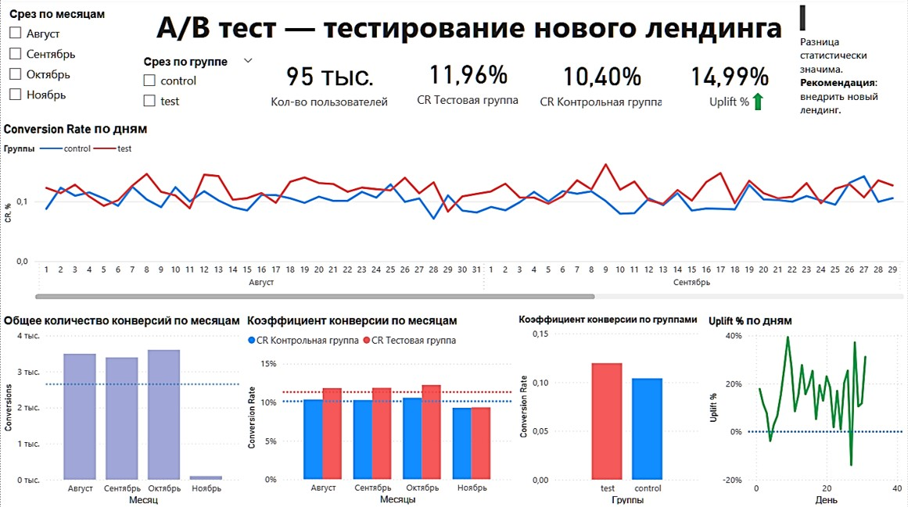
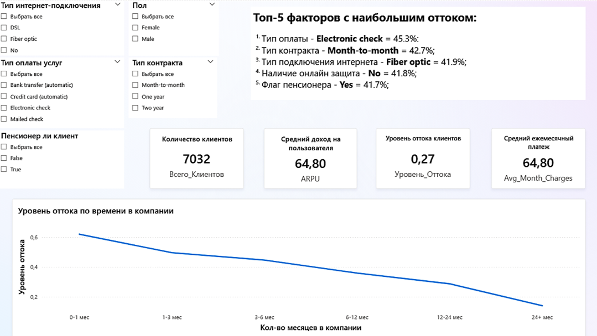
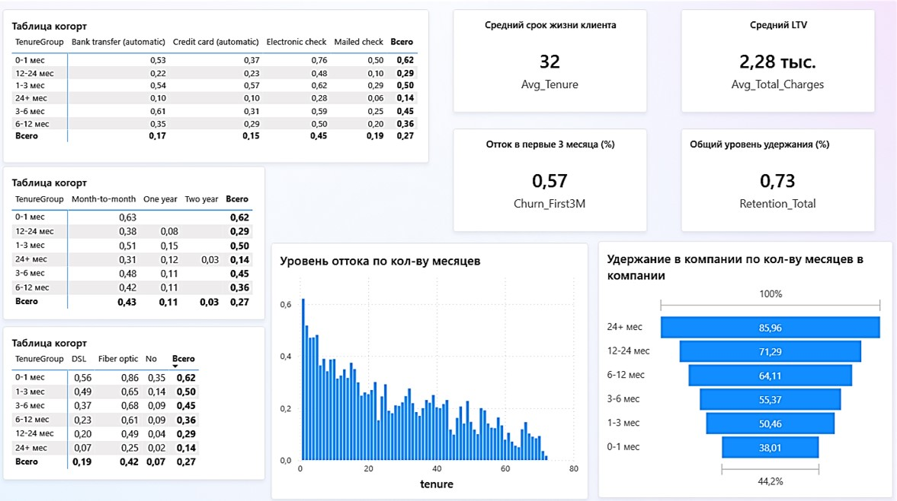
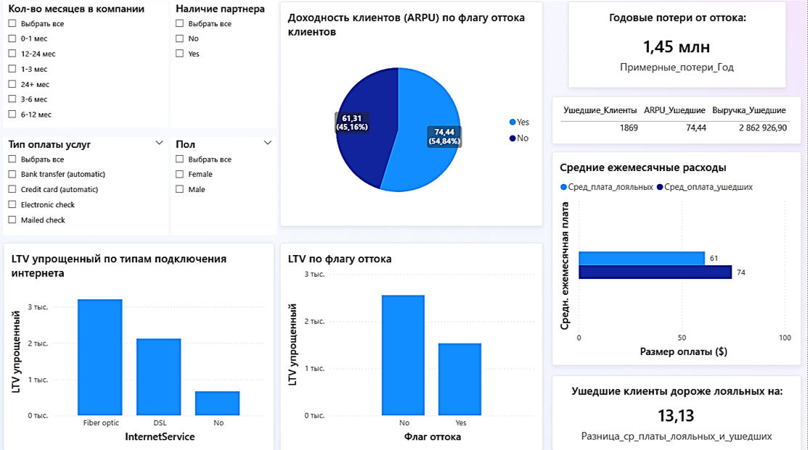

# Дашборды
## 1. A/B тест - новый лендинг (Power BI Dashboard)

### Цель: 
**Проверить влияние нового лендинга на конверсию (CR) с помощью A/B теста и оценить статистическую значимость результата.**

### Данные:
- 95 000 пользователей, разделённых на **контрольную** и **тестовую** группы;
- Метрики:
  - `Users` — количество пользователей;
  - `Conversions` — количество конверсий;
  - `CR` (Conversion Rate) = Conversions / Users;
  
###  Превью дашборда
[Файл с дашбордом "ab_dashboard.pbix"](https://github.com/sasergeevna/dashboards.github.io/blob/main/ab_dashboard.pbix)

 

### Дашборд отражает:

#### KPI
- Кол-во пользователей;  
- CR Контрольная группа;  
- CR Тестовая группа;  
- Uplift %;

#### Визуализации
- **Conversion Rate по дням**;
- **Uplift % по дням** (стабильность эффекта во времени);  
- **Количество конверсий по месяцам**;  
- **Средний Conversion Rate по группам и месяцам**;
- **Абсолютные конверсии в тестовой и котрольной группах**;  
- **Текстовый блок с бизнес-выводом и рекомендацией**;  

### Вывод:
- Коэффициент конверсии в тестовой группе = **11,96%**;
- Коэффициент конверсии в контрольной группе = **10,40%**;  
- Uplift = **+14,99%**;  
- p-value ≪ 0,05 - разница **статистически значима**;  
- **Рекомендация**: внедрить новый лендинг;  

## 2. Анализ оттока клиентов и ключевых факторов удержания

### Цель: 
**Проанализировать отток клиентов телеком-компании, выявить сегменты клиентов с наибольшим риском ухода и определить ключевые факторы, влияющие на отток, чтобы сформулировать рекомендации по его снижению.**

Данные:

- Выборка: 7 032 клиента;
- Ключевые метрики: Уровень оттока (27%), ARPU ($64.80), Средний срок жизни клиента (32 мес.), LTV ($2.28 тыс.);
- Анализируемые признаки: Демография (пенсионер), тип контракта, способ оплаты, тип интернет-подключения, технологические услуги (Online Security), лояльность (время в компании);

###  Превью дашборда
[Файл с дашбордом "telcom_dashboard.pbix](https://github.com/sasergeevna/dashboards.github.io/blob/main/telcom_dashboard.pbix)

 

 

 

### Дашборд отражает:

- Ключевые показатели (KPI):
  - Общее количество клиентов и уровень оттока;
  - Средний доход на пользователя (ARPU) и средний ежемесячный платеж;
  - Средний срок жизни клиента и Lifetime Value (LTV);
  - Уровень оттока в первые 3 месяца и общий уровень удержания;
- Визуализации и углубленный анализ:
  - Топ-5 факторов оттока: Ранжирование признаков с наибольшим процентом уходящих клиентов;
  - Когортный анализ оттока: Динамика уровня оттока в зависимости от времени, проведенного в компании (тенура), для ключевых факторов:
    - По типу оплаты (Electronic check, Bank transfer и др.);
    - По типу контракта (Month-to-month, One year, Two year);
    - По типу интернет-подключения (Fiber optic, DSL, No);
  - Удержание по времени в компании: Как изменяется лояльность клиентов с ростом их стажа;
  - График оттока по тенуру: Наглядное отображение риска ухода на разных этапах жизненного цикла клиента;

### Выводы:

1. Ключевые факторы риска: Наибольший вклад в отток вносят клиенты с помесячной оплатой (Electronic check), краткосрочным месячным контрактом (Month-to-month) и подключением по оптоволокну (Fiber optic);
2. Критический период: Наибольший риск оттока наблюдается в первые 3-6 месяцев жизни клиента (отток достигает 45-62%);
3. Влияние лояльности: Клиенты с долгосрочными контрактами (год и более) и клиенты, пользующиеся услугами более 2 лет, демонстрируют исключительно низкий уровень оттока (<3%) и высокий уровень удержания (>85%);

